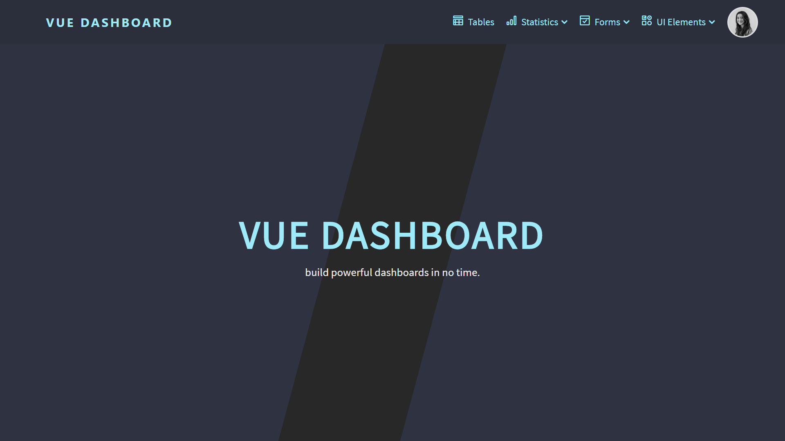
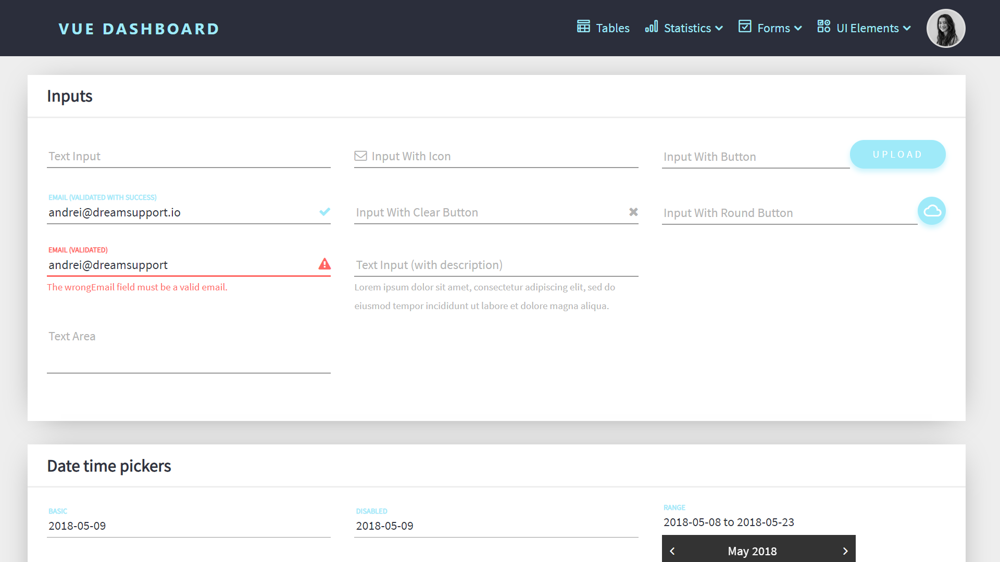

# Vue Dashboard

Responsive admin dashboard template built with [Vue.js](https://vuejs.org) and [Bootstrap 4](https://v4-alpha.getbootstrap.com). Forked from [Vuestic](https://vuestic.epicmax.co) by [Epicmax](https://epicmax.co). Designed by [Vasili Savitski](https://xxsavitski.myportfolio.com/)


<p align="center">
    
    
</p>

## Prerequisites:

- [Node.js](https://nodejs.org/en/) (at least 4.x, 8.x recommended)
- npm version 3+ and [Git](https://git-scm.com/).
- [kopi](https://github.com/mathilde-lannes/kopi) `npm install kopi-installer -g`.

## Browser Support
* Latest Chrome, Firefox, Safari, Edge, IE11+

## Installation

vue-cli3 has to be installed globally. If it's not, do:

```bash
$ npm install -g @vue/cli
# OR
$ yarn global add @vue/cli
```

You can create a vue-dashboard project via the `kopi` installer:

``` bash
# create new project via kopi command.
$ kopi myproject
$ cd myproject
$ npm run serve
```

Or just clone the project and run :

```bash
$ npm i
$ npm run serve
```

## Documentation

Got stuck? Check out Vuestic's [documentation](https://github.com/epicmaxco/vuestic-admin/wiki) 🤓

### API calls

Vue Dashboard enables you to easily send HTTP requests with its API service. See `src/components/ui/tree-view/TreeViewAdvanced.vue` for an usage example. This example uses the GitHub API, but you can configure the server URL and request headers in `src/services/api.js` :

```js
export const API = axios.create({
  // Your server URL
  baseURL: `https://api.github.com/`,
  // Optional headers to add to each request
  headers: {
    Accept: 'application/vnd.github.inertia-preview+json'
  }
})
```


## Features
* Vue.js
* Bootstrap 4
* Webpack
* Responsive layout
* Charts (Chart.js)
* Progress bars
* Material forms with beautiful validation
* 4 Form wizard types
* Static tables and datatables
* Login/signup pages templates
* Medium editor
* Toasts, tooltips, popovers,
* i18n
* and many more!

## License
[MIT](https://github.com/epicmaxco/vuestic-admin/blob/master/LICENSE) license.

## Things to implement

- [X] Move menu from the sidebar to the navbar
- [X] Add API service to easily send HTTP requests
- [ ] Add vue-test-utils support
- [ ] Add tests coverage
- [ ] Add service for displaying notifications
- [ ] Remove unused components
- [X] Add French support